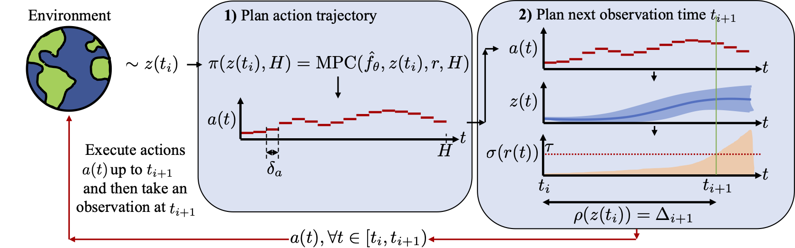
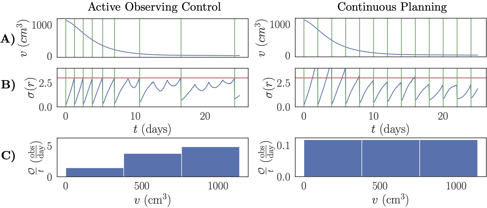

# [NeurIPS 2023] Active Observing in Continuous-time Control


[](https://openreview.net/pdf?id=o0ggjFD24U)
[](https://opensource.org/licenses/MIT)
[](https://github.com/psf/black)

This repo holds the code, and log files for [Active Observing in Continuous-time Control](https://openreview.net/pdf?id=o0ggjFD24U) by Samuel Holt, Alihan Hüyük, and Mihaela van der Schaar.

#### Introduction

For the first time, we introduce and formalize the problem of continuous-time control with costly observations, theoretically demonstrating that irregular observation policies outperform regular ones in certain environments. We empirically validate this finding using a novel initial method: applying a heuristic threshold to the variance of reward rollouts in an offline continuous-time model-based Model Predictive Control (MPC) planner across various continuous-time environments, including a cancer simulation. This work lays the foundation for future research on this critical problem.





#### Setup

To get started:

1. Clone this repo
```bash
git clone https://github.com/samholt/ActiveObservingInContinuous-timeControl && cd ./ActiveObservingInContinuous-timeControl
```

2. Follow the installation instructions in `setup/install.sh` to install the required packages.
```bash
./setup/install.sh
```

#### Replicating the main results

To replicate the main results, run the following commands:

```bash
python mppi_with_model_active_observing.py
```

Once the run has completed, process the log file generated output into the `logs` folder, with the script `process_results/analyzer.py`. Note, you will need to edit the `process_result_file.py` to read this generated log file, i.e., specify the path variable of where it is. This will generate the main tables as presented in the paper.


#### Retraining the dynamics models from scratch

1. Modify the configuration dictionary in file `config.py`.
2. You can either re-train an individual model, or all the models together using multiprocessing.
  2.a To re-train a single model, modify the settings (i.e. the `model_name` and `train_env_task`) of `train_utils.py` and run `python train_utils.py`.
  2.b To re-train all the models together, run `python train_all_models.py`.
  2.c Note, when re-training a model, it should be trained until it converges. A good rule is after three days per model with a NVIDIA RTX 3090 (adapt accordingly based on your available GPU or compute).
3. For any newly trained model, you will now have to tune a new threshold parameter as described in the paper, by running it using the `mppi_with_model_active_observing.py` script. Specifically running with the method of `continuous_planning` for a `pe` model or `discrete_planning` for a `pe-discrete` model. You will have uncomment the line ` print(f"THRESHOLD: {df.mean()['costs_std_median']}")` and turn on debug mode and plot_telem in the config. This will print out the threshold value to use for the model. You will then have to update the `config.py` file with this new threshold value for your model.
4. To re-run with the newly trained models, continue with the same replicating the main results instructions above.

### Cite

If you use our work in your research, please cite:

```bibtex
@inproceedings{
    holt2023active,
    title={Active Observing in Continuous-time Control},
    author={Samuel Holt and Alihan H{\"u}y{\"u}k and Mihaela van der Schaar},
    booktitle={Thirty-seventh Conference on Neural Information Processing Systems},
    year={2023},
    url={https://openreview.net/forum?id=o0ggjFD24U}
}
```